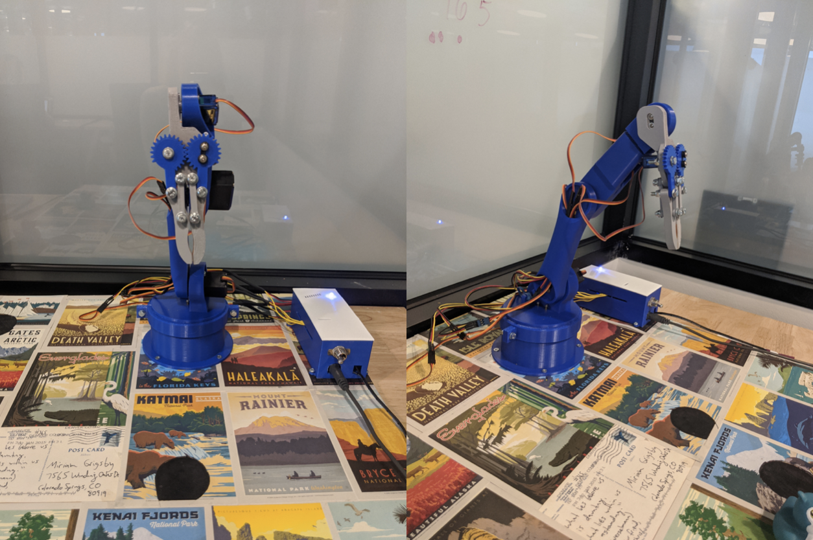
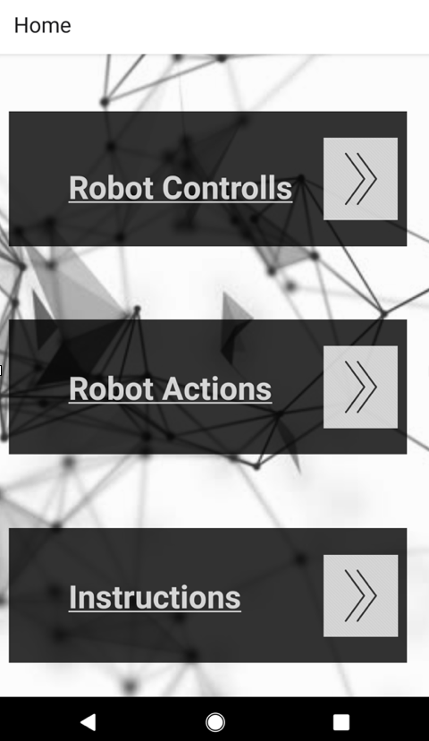
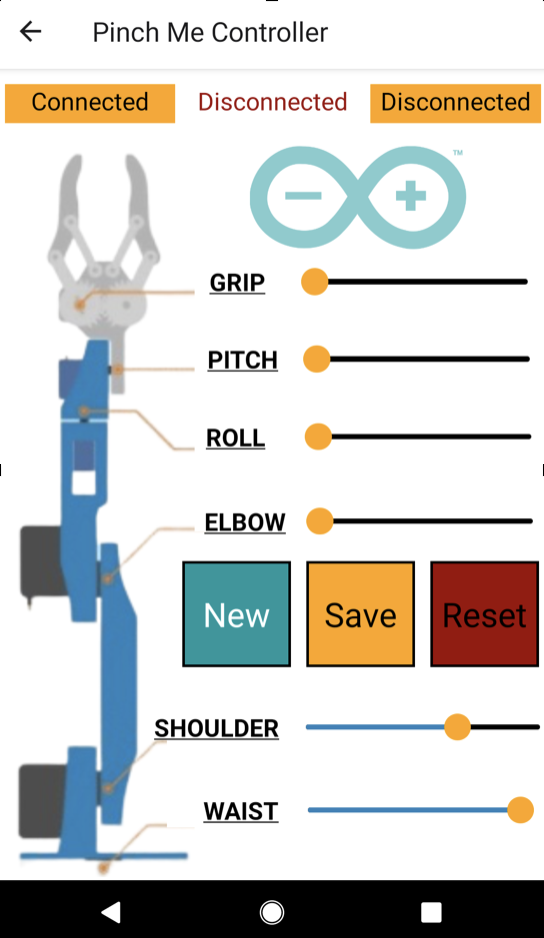
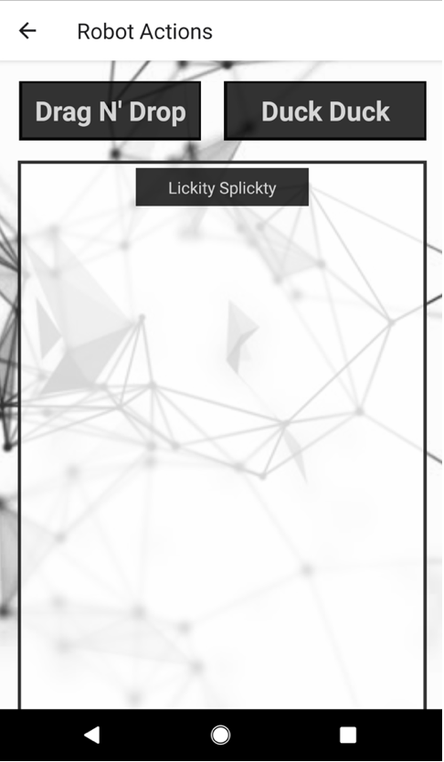

A Golang application using Gobot and Firmata Protocol in conjunction with an arduino mega 2560 and React-Native phone application to control a 3-D printed robotic arm. 

## Video Walk Through

* [Walk Through Video](https://www.youtube.com/watch?v=_EJAylseR3s)

## Motivation

In order to truly understand software and apply it to everyday life, I felt it was important to develop a hardware project. Arduinos are simple and a great way to learn about serial connections, the arduino IDE, and movement which served as an effective introduction to robotics.   

## Getting Started

If you wish to fork/clone the repo, do so in conjunction with the frontend found at [Back End Repo](https://github.com/miriamgrigsby/go-pinch-me). 

### Golang Version

go1.13.5 

### Tech Stack

Golang Backend with a PostgreSQL database 

React Native Frontend 

### Installation

The app front is built with React Native which requires the following commands to run: 

    Download the Expo application for React Native development onto mobile device
    
    Scan QR code with phone's camera which will open app in Expo
    
    Change IP address of all axios requests to match your IP address

    Run expo start
    
The app back is built in Golang with Gobot and Firmata Protocol with a PostgreSQL database

    Check for Golang version by running: 
      go version
    
    Run go run main.go 
    
### React Native Dependencies/Node Packages

The app requires the following packages: 

    npm i --save react-native-slider
    
    npm install axios
    
    npm i react-native-gesture-handler
    
    npm install react-navigation-stack 
    
### Golang Libraries/Imports

The app requires the following packages: 
  Run these in the command line: 

	go get database/sql
	go get database/sql/driver
	go get encoding/json
	go get errors
	go get fmt
	go get sync
	go get time
	go get github.com/gin-contrib/cors
	go get github.com/gin-gonic/gin
	go get gobot.io/x/gobot/platforms/firmata
	go get github.com/lib/pq
 
 Note: the database will not exist, unless the app is deployed. 
 
### Features

The main features of the app include: changing the parts of the robot with sliders, building a custom set of movements to be played together, playing a set or default movement, and deleting any created set of movements. 

### Operation Overview

From the landing page, the user can click on Robot Controlls, Robot Actions, or Instructions. Inside Robot controlls, the user can manipulate individual robot movements or create a custom set of movements. Robot Actions allows the user to click on the default movements at the top, or upon any new set someone has made in the box below to watch the movements play out in real time. These new movements can also be deleted. The Instructions page gives the user more information about how to use the application. At any point, the user can click the back arrow in the top left corner to return to the landing page. 

 

### Robot Controlls

Start by clicking on Connected at the top to open a serial connection to the arduino. The blue light will illuminate to indicate that a connection has been made, and the robot will move to its default position. Disconnecting will turn off the light, but will NOT actually break the connection. Below these connection buttons are sliders that control each part of the arm. The sliders match up with each part on the diagram on the left. The sliders all begin at the robot's default position. Slide them back and forth to test out what each portion of the arm does. Moving the slider at different speeds will move the robot accordingly. The roll is wild and moves out of control and at this time is intentionally disconnected. At any point, press Reset to reset the robots sliders back to default. 

### Creating a Set of Custom Robot Actions
    
On the Robot Controlls page, click New to begin creating a custom robot. Its first position will always be the default. Now adjust the sliders to the desired positions. The sliders will STILL affect the robot giving you a visual of what your outcome will be. Click Add to add that set of motions to the overall robot. Continue with these steps to create simple or complex motions. When the desired motions are complete, click save and take note of the randomly assigned name in the pop-up. This pun-ny name will now populate on the Robot Actions page for you to see it all come together. At any point press Reset to  destroy your current build and start over. 

### Robot Actions

At the top of the screen are the two default robot action sets, Drag N' Drop and Duck Duck. Drag N' Drop will pick up a rubber ducky, and rotate to drop it into a cup on the left. Duck Duck plays Duck Duck Goose with 3 rubber duckies. The body will rotate to lightly "boop" two ducks in a row before picking up a third duck sitting front and center. After picking up the duck, it will lightly return it to the ground. 

### Playing the Custom Actions
    
Because these actions are saved in the database, they will NOT appear in the box below the defaults unless the Golang Server is running. Once they appear, click on the action to see it play out in full. Press and hold the action to delete it. BE WARNED, this action cannot be undone and happens when the button is held for just over a second. A pop-up will then appear to confirm it was deleted from the database. 

